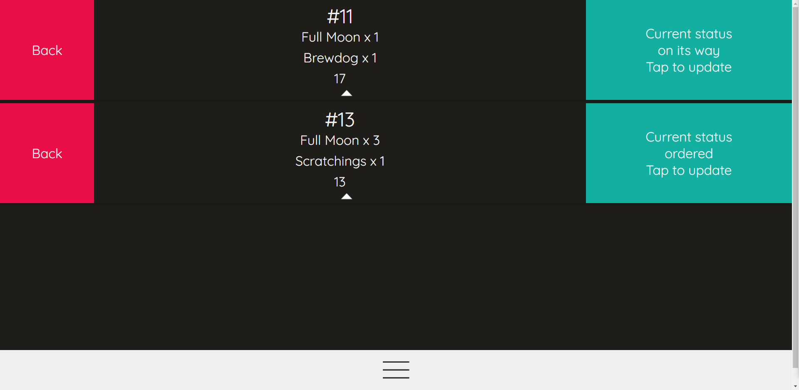
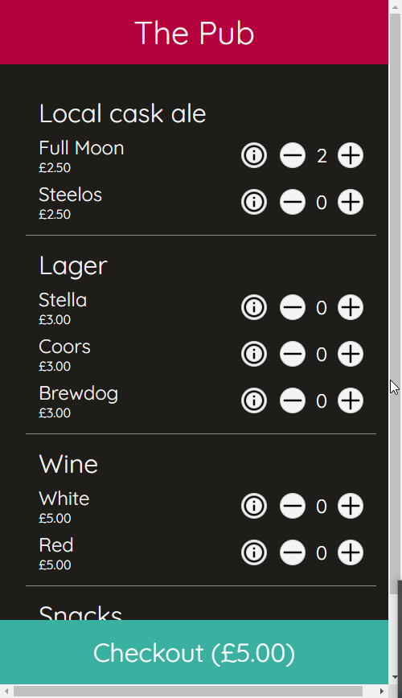
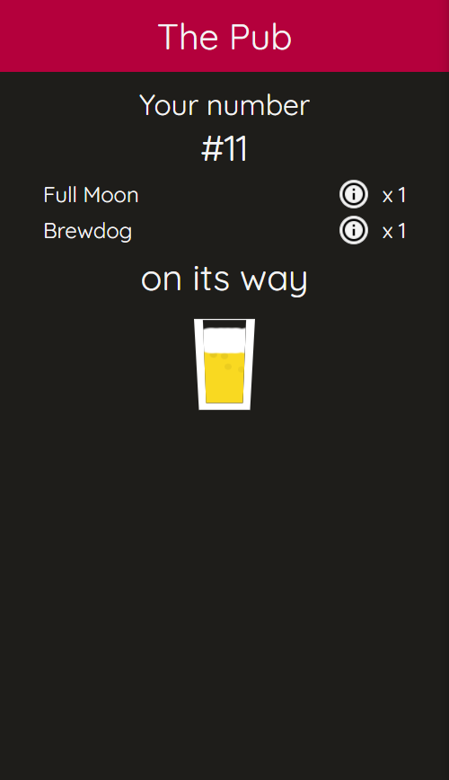

# What is this
MIT license React App for table service, bodged together from [Felix Weinberger](https://github.com/felixweinberger)'s Bar-Q project.

# Why is this
I stumbled upon the [original Bar-Q](https://github.com/felixweinberger/barq-server) in the early days of the pandemic and figured that it might help some of the independent pubs near me in providing socially distanced table service, and hopefully help me to learn React and Docker. 

My end goal is to learn enough that I can eventually provide this as an MIT License based project to allow smaller bars to compete with chain breweries, which often have their own IT teams and are more able to adapt to the technical needs of social distancing measures. I want to make this as close to free as possible, and will be conducting trials with local bars in the coming weeks in order to gauge the most cost effective hosting method.

# What I've done so far
I originally just updated some dependencies and a few other things that have skipped my mind, and a PR on the original project is pending.

I've pressed forwards making this app table service only, but plan to implement a better UI for this. 

I have a backup of the original app complete with card payment functionality that will be uploaded to GitHub soon, but I'm focussing on the table service aspect right now since this is what my local bars need. This means that some of the underlying card payment functionality is still in this code, and that it is more than likely even more inefficient than when I "fixed" it.

# What needs to be done

I plan to improve the table service UI and strip back any more code which is now ubiquitous (looking at you Stripe payments). I also need to implement ENV vars.

# What can you do with this

## Admin view allowing for multiple bars

Make an admin panel, have multiple users, run it for many different pubs using the same admin login. Alternatively, run one bar upstairs, one bar downstairs, one food menu, and a different menu of your choosing, each with the same admin login but different QR codes.

(Remember when I said I should have used ENV variables? If you're smarter than I am, use them here)

Menus are a simple CSV upload. You can create QR codes for your customers, or even your staff if you want. If you look at the original, there's some Stripe and IBAN stuff in there.

You can get new login codes every time you load the staff bar so that dodgy Dave who sits behind the bar doesn't keep queueing his beer up first.

Please don't rinse the linked bars or QR codes in the image. I'm redundant and probably hosting this in a suboptimal way. Don't bankrupt me.

## Staff view

View past orders, view current orders, update them even. You can even block the bar and prevent new orders from happening. Madness.

## Customer view

Scan a QR code, view the menu, place an order, watch the progress of your drink. Do it again until kicking out time.

## Docker

It's a thing I barely understand. I can't believe I managed to host it somewhere apart from localhost and made it work. You will probably know what to do with this, or your IT guy will.

# Disclaimer
I bodged this together to make it work hopefully well enough that someone more experienced can make use of it, hopefully while keeping the same spirit of this being as open source as possible so that the good folk in the hospitality industry don't have to spend too much to keep us fed and watered.

This was originally a project by [Felix Weinberger](https://github.com/felixweinberger)'s Bar-Q repository. Thank you Felix for the intro by fire to React and Docker, and for making it available on the MIT license.
